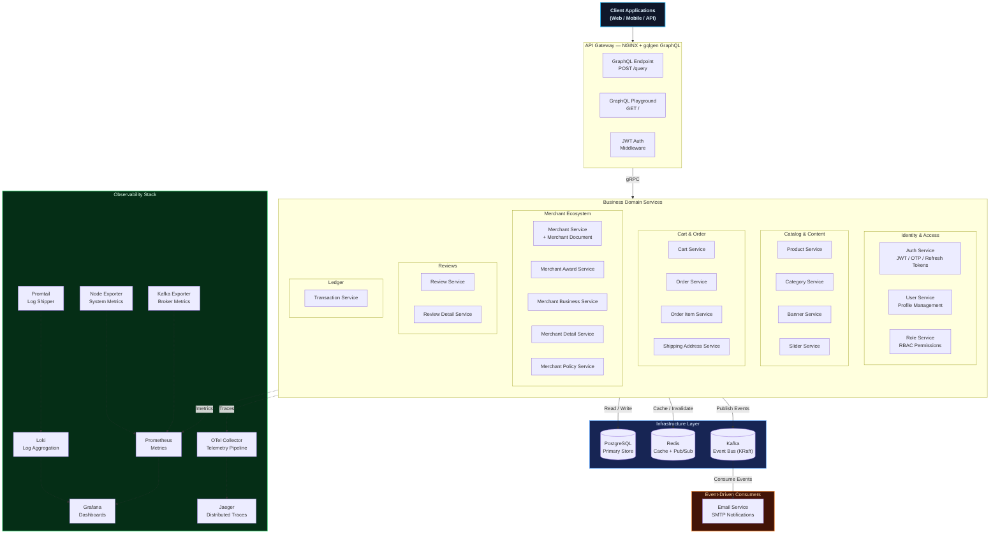
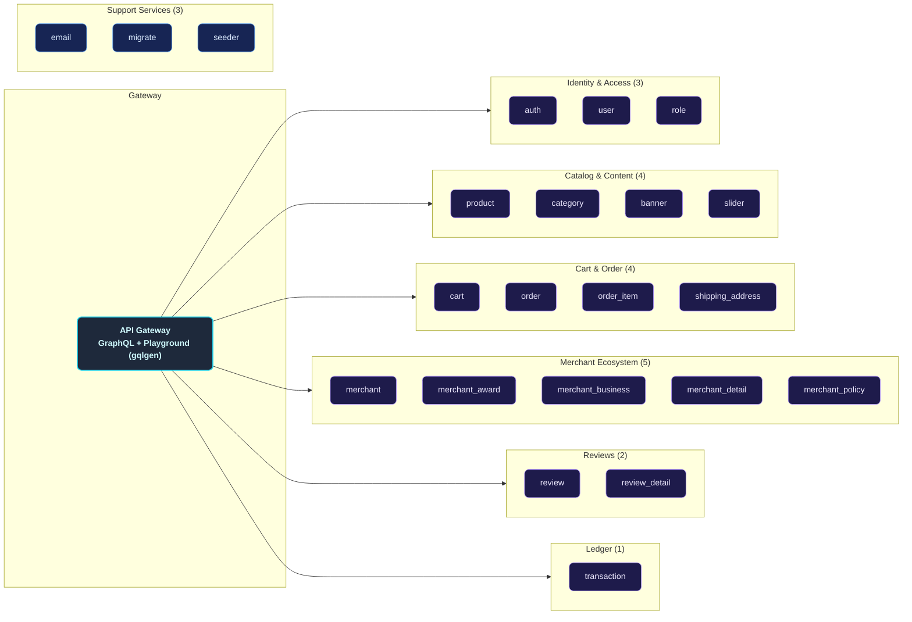
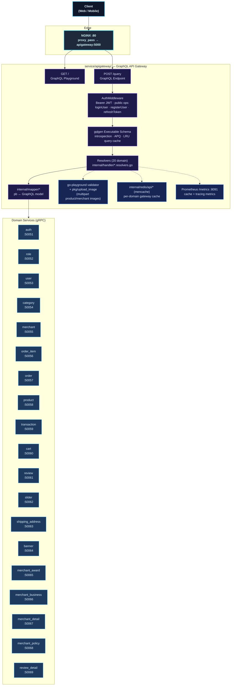
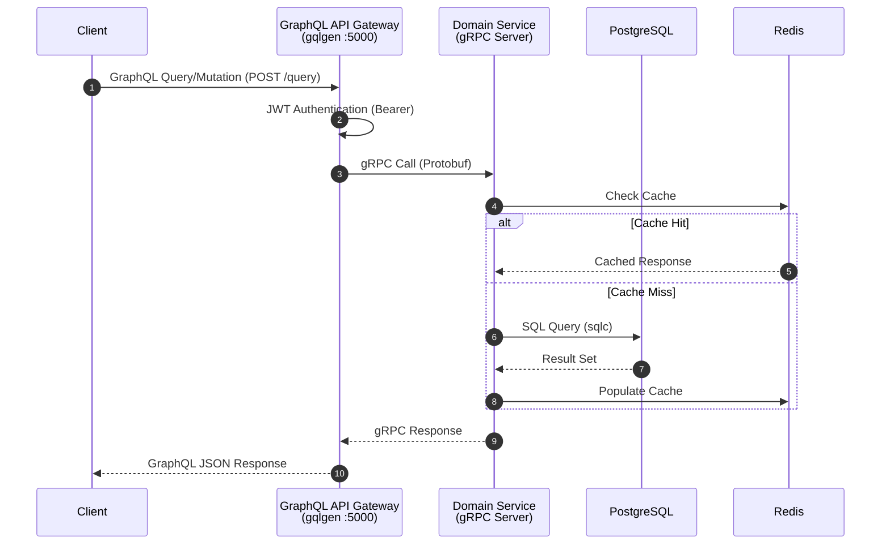
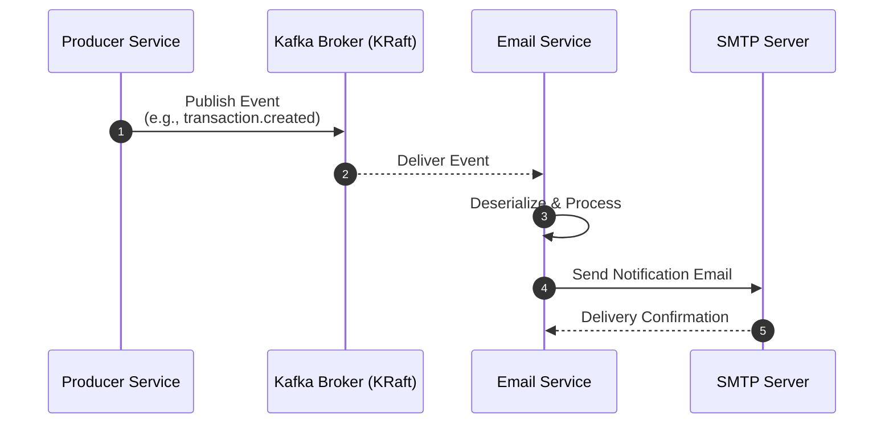
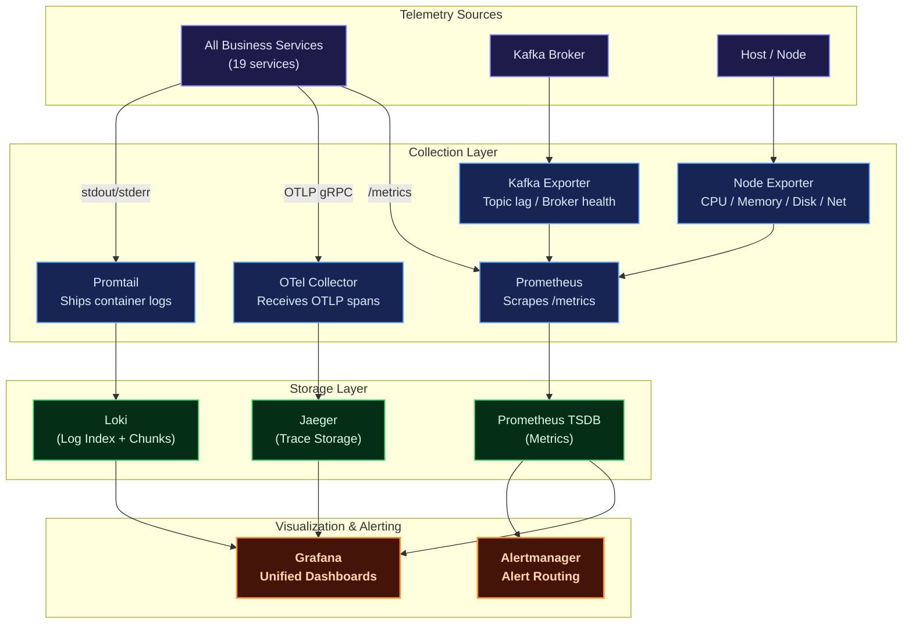
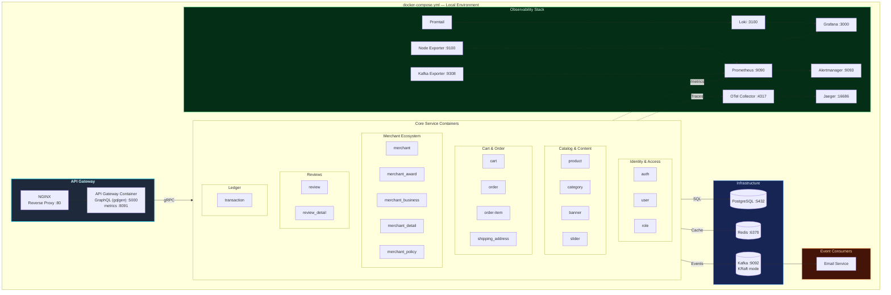

# Distributed Modular Monolith — E-Commerce Platform

A production-grade, **modular-monolith e-commerce backend** built with **Go (Golang)**, designed around domain-driven service boundaries while retaining the operational simplicity of a single deployment unit. Each business domain — Users, Roles, Products, Categories, Carts, Orders, Merchants, Reviews, Transactions — lives in its own self-contained module with a clean internal architecture, yet all modules ship as independently deployable containers that communicate via **gRPC** and asynchronous **Kafka** events.

The platform ships with a **full observability stack** (Prometheus, Grafana, Loki, Jaeger, OpenTelemetry), **Redis caching** with instrumented metrics, **circuit-breaker & rate-limiting** resilience patterns, and **Kubernetes** manifests delivered via **ArgoCD** GitOps (namespace `ecommerce`), featuring Horizontal Pod Autoscalers (HPA) and Pod Disruption Budgets (PDB) per service.

---

## Key Features

| Domain | Capabilities |
|--------|-------------|
| **GraphQL API** | Schema-first gateway (gqlgen) — Playground, introspection, JWT Bearer auth, automatic persisted queries, LRU query caching, multipart file upload, dedicated metrics endpoint |
| **Auth & Users** | Registration, login, JWT access/refresh tokens, password recovery & OTP verification, role-based authorization (RBAC) |
| **Products & Categories** | Product CRUD, category management, hierarchical navigation, product statistics |
| **Carts & Orders** | Cart management, order lifecycle, line-item tracking, shipping address management |
| **Merchant Ecosystem** | Merchant onboarding, business info, merchant details, policies, awards, document verification, social links, status lifecycle |
| **Reviews** | Product reviews & ratings, review detail management |
| **Banners & Sliders** | Promotional banner management, homepage slider configuration |
| **Transactions** | Payment recording, status tracking, event-driven confirmation pipelines |
| **Notifications** | Kafka-driven email service for auth, merchant, and financial-event confirmations |
| **Observability** | Metrics (Prometheus + Grafana), Logging (Loki + Promtail), Tracing (Jaeger + OpenTelemetry), System metrics (Node Exporter), Kafka metrics (Kafka Exporter) |
| **Deployment** | Docker Compose for local dev, Kubernetes manifests + ArgoCD GitOps for production |

---

## Architecture Overview

The platform follows a **Distributed Modular Monolith** architecture — each module is a self-contained Go binary with its own clean-architecture internals, deployed as an independent container. An **API Gateway** (NGINX + gqlgen GraphQL) provides a unified **GraphQL API** entry point — the single client-facing surface — translating GraphQL queries and mutations into gRPC calls to downstream services.

### Core Architecture Principles

- **Single Responsibility**: Each service owns its domain logic, data access, and caching layer
- **Clean Architecture**: Every service follows `handler → service → repository` with clear dependency injection; the gateway follows `resolver → mapper → gRPC client`
- **Event-Driven Decoupling**: Kafka enables asynchronous communication without direct service dependencies
- **Observability-First**: Every service is instrumented with OpenTelemetry traces, Prometheus metrics, and structured logging
- **Resilience Patterns**: Built-in circuit breakers, request rate limiters, and load monitors in the shared `pkg/resilience` package



---

## Service Catalog

The platform is composed of **19 independently deployable business services** plus supporting infrastructure (23 total):



---

## GraphQL API Gateway

The gateway (`service/apigateway/`) is a **schema-first GraphQL server** built with [gqlgen](https://gqlgen.com/). It holds no database of its own — every resolver translates the GraphQL operation into **gRPC calls** to the domain services. The REST layer of previous versions has been fully replaced: there are no REST routes, no Swagger annotations, and no `echo-swagger` — GraphQL introspection + Playground serve as the API documentation.

### Endpoints

| Endpoint | Description |
|----------|-------------|
| `GET /` | GraphQL Playground (interactive schema explorer) |
| `POST /query` | GraphQL API endpoint (also supports `GET` and `multipart/form-data` for file uploads) |

Both are proxied by NGINX (`:80`) and served directly by the gateway (`:5000`, configurable via `CLIENT_PORT`). The gateway also runs a standalone **Prometheus metrics server on `:8091`** — internal to the container network (not published by Docker Compose; Kubernetes manifests expose it as a separate container port).

### Authentication

`/query` is wrapped by a JWT `AuthMiddleware` (`internal/middlewares/auth.go`):

- Every request must carry `Authorization: Bearer <access_token>`
- **Public operations** skip the token check: `loginUser`, `registerUser`, and `refreshToken`
- The token is validated with the shared `pkg/auth` JWT manager; claims flow into the resolver context for downstream gRPC calls

### Gateway Internals



Notes:

- **19 gRPC services, 20 client groups** — merchant social links are resolved through the *merchant service* connection (`pb/merchant_social_link` sub-package exposes `MerchantSocialCommandServiceClient` on the same merchant conn), so there is no separate social-link container. Stats helpers (`CategoryStats*`, `OrderStats`, `TransactionStats*`) reuse the category/order/transaction connections.
- **No Kafka in the gateway** — the gateway is purely synchronous (GraphQL → gRPC → cache). All event publishing happens inside the domain services.
- **gqlgen extensions** — introspection enabled, Automatic Persisted Queries (APQ), and an LRU parsed-query cache (1000 entries).
- **Per-domain mencache** — `internal/redis/api/<domain>/` provides gateway-side caching of hot reads on a dedicated Redis instance (`REDIS_DB_APIGATEWAY`), instrumented with cache-hit/miss metrics.

### Schema & Code Generation

GraphQL schemas live in `graphql/*.graphqls` (one file per domain — 20 domain schemas + `common.graphqls` for shared scalars/pagination types). gqlgen generates everything else:

| gqlgen output | Path |
|---------------|------|
| Executable schema | `internal/handler/generated.go` |
| Generated models | `internal/model/models_gen.go` |
| Resolver stubs (follow-schema) | `internal/handler/{name}.resolvers.go` |

After editing a schema, regenerate with:

```sh
cd service/apigateway
go run github.com/99designs/gqlgen generate
```

If the underlying protobuf contracts changed, run `just generate-proto` first — the mappers depend on the generated code in `shared/pb/`.

### Example Operations

Login (public — no token required):

```graphql
mutation Login {
  loginUser(input: { email: "admin@example.com", password: "secret" }) {
    status
    message
    data {
      access_token
      refresh_token
    }
  }
}
```

Paginated product list (requires Bearer token):

```graphql
query Products {
  findAllProducts(input: { page: 1, pageSize: 10, search: "sneakers" }) {
    status
    message
    data {
      id
      name
      price
      countInStock
      brand
    }
    pagination {
      current_page
      page_size
      total_pages
      total_records
    }
  }
}
```

Via HTTP:

```sh
curl -s http://localhost:5000/query \
  -H 'Content-Type: application/json' \
  -H "Authorization: Bearer <access_token>" \
  -d '{"query": "query { findAllProducts(input: { page: 1, pageSize: 10 }) { status data { id name } pagination { current_page } } }"}'
```

---

## Internal Service Architecture

Every business service follows a **Clean Architecture** pattern with strict layering. Dependencies flow inward, keeping the core business logic free from infrastructure concerns.

```mermaid
graph TB
    classDef handler fill:#1e3a5f,stroke:#7dd3fc,color:#e0f2fe,stroke-width:1.5px
    classDef service fill:#1e1b4b,stroke:#a78bfa,color:#ede9fe,stroke-width:1.5px
    classDef repo fill:#172554,stroke:#60a5fa,color:#dbeafe,stroke-width:1.5px
    classDef infra fill:#052e16,stroke:#4ade80,color:#dcfce7,stroke-width:1.5px
    classDef shared fill:#431407,stroke:#fb923c,color:#fed7aa,stroke-width:1.5px

    subgraph Service["service/<name>/"]
        direction TB

        CMD["cmd/main.go<br/>Entry Point"]
        APPS["apps/<br/>Dependency Wiring"]:::handler
        HANDLER["handler/<br/>gRPC Handlers"]:::handler
        MW["middleware/<br/>Interceptors"]:::handler
        SVC["service/<br/>Business Logic"]:::service
        CACHE["cache/<br/>Redis Cache Layer"]:::service
        REPO["repository/<br/>Data Access (sqlc)"]:::repo

        CMD --> APPS
        APPS --> HANDLER
        APPS --> SVC
        APPS --> CACHE
        APPS --> REPO
        HANDLER --> SVC
        SVC --> REPO
        SVC --> CACHE
    end

    subgraph SharedLibs["shared/ — Shared Libraries"]
        direction LR
        DOMAIN["domain/<br/>record / requests / response"]:::shared
        OBS["observability/<br/>cache_metrics / tracing_metrics"]:::shared
        CACHESHARED["cache/<br/>redis_cache.go"]:::shared
        MAPPER["mapper/<br/>Domain ↔ Proto"]:::shared
        CONVERT["convert/<br/>Env / Type Helpers"]:::shared
        ERRORS["errors/ + errorhandler/<br/>per-domain error types"]:::shared
        PB["pb/<br/>Generated Protobuf Go"]:::shared
    end

    subgraph PkgLibs["pkg/ — Platform Libraries"]
        direction LR
        PKGAUTH["auth/<br/>JWT Manager"]:::infra
        PKGKAFKA["kafka/<br/>Producer / Consumer"]:::infra
        PKGOTEL["otel/<br/>Tracing + Metrics Init"]:::infra
        PKGRES["resilience/<br/>Circuit Breaker<br/>Rate Limiter<br/>Load Monitor"]:::infra
        PKGLOG["logger/<br/>Zap Structured Logging"]:::infra
        PKGSRV["server/<br/>gRPC Server Bootstrap"]:::infra
        PKGDB["database/<br/>PostgreSQL + Migrations<br/>+ Seeders"]:::infra
        PKGOUTBOX["outbox/<br/>Transactional Outbox<br/>+ Consumer Inbox"]:::infra
        PKGUPLOAD["upload_image/<br/>Image Upload Utility"]:::infra
    end

    REPO --> DOMAIN
    SVC --> DOMAIN
    SVC --> OBS
    HANDLER --> MAPPER
    APPS --> PKGSRV
    APPS --> PKGOTEL
    APPS --> CACHESHARED
    APPS --> OBS
```



> Generated protobuf code lives in the `shared/pb/` module (source: `proto/`), and is imported by services and the gateway alike.

---

## Data & Event Flow

### Synchronous Flow (GraphQL → gRPC)

All client-facing requests flow through the GraphQL gateway, which forwards them over gRPC to the appropriate domain service.



### Asynchronous Flow (Kafka Events)

Services publish domain events to Kafka topics. Downstream consumers (e.g., Email Service) react to these events without coupling to the producer.



---

## Kafka & Event-Driven Architecture

Platform menggunakan Apache Kafka sebagai event backbone untuk **notifikasi
email asinkron**. Tiga service mempublikasikan event ke **8 topik domain**,
dan satu service (email) menjadi satu-satunya consumer utama. Email service
juga memproses **1 topik retry** dan **1 topik DLQ** untuk kegagalan SMTP
sementara.

### Topologi Topik (8 topik domain + retry/DLQ)

| Topik | Producer | Fungsi |
|:------|:---------|:-------|
| `email-service-topic-auth-register` | auth | Email selamat datang + verifikasi |
| `email-service-topic-auth-forgot-password` | auth | Email OTP reset password |
| `email-service-topic-auth-verify-code-success` | auth | Email verifikasi sukses |
| `email-service-topic-merchant-create` | merchant | Email pembuatan akun merchant |
| `email-service-topic-merchant-update-status` | merchant | Email perubahan status merchant |
| `email-service-topic-merchant-document-create` | merchant | Email dokumen merchant dibuat |
| `email-service-topic-merchant-document-update-status` | merchant | Email status dokumen merchant |
| `email-service-topic-transaction-create` | transaction | Email transaksi baru |
| `email-service-topic-email-retry` | email (internal) | Retry pengiriman SMTP yang gagal sementara |
| `email-service-topic-email-dlq` | email (internal) | Dead-letter untuk event yang gagal total |

Konvensi penamaan: `email-service-topic-<domain>-<event>`. Semua topik
dibuat otomatis oleh broker (`KAFKA_AUTO_CREATE_TOPICS_ENABLE=true`).

### Producer & Consumer Matrix

| Service | Produce | Consume |
|:--------|:--------|:--------|
| auth | 3 topik | — |
| merchant | 4 topik | — |
| transaction | 1 topik | — |
| email | 2 topik (retry + DLQ) | 9 topik (8 domain + 1 retry; DLQ tidak dikonsumsi) |
| lainnya (user, role, banner, cart, category, product, order, order_item, shipping_address, review, review_detail, slider, merchant_award, merchant_business, merchant_detail, merchant_policy) | — | — |

### Transactional Outbox Pattern

Semua producer email menulis event ke tabel **`outbox_events`** dalam transaksi
DB yang sama dengan data bisnisnya. Relay `pkg/outbox` mengirim ke Kafka secara
async dengan **retry 5x + backoff eksponensial + dead-letter** (status `dead`
untuk event yang gagal total).

```text
DB commit + outbox insert ──(atomic)──► Relay publikasi ──► Kafka send ──► Email consumer
                                        retry 5x + backoff        inbox dedup → email sekali
```

> **Jaminan inti:** insert data bisnis + insert outbox dalam transaksi DB
> yang sama → Kafka down tidak kehilangan event. Event tetap aman di DB
> dan terkirim saat broker kembali.

### Consumer Inbox & Email Deduplication

Consumer menggunakan **PostgreSQL-backed inbox** (`pkg/outbox` → `NewPostgresInbox`)
untuk **deduplikasi durable** dan **retry-topic offloading** pada kegagalan SMTP
sementara:

- **Dedup:** event yang sudah diproses (per topic + partition + offset) tidak
  dikirim ulang, bahkan setelah restart consumer.
- **Retry:** kegagalan SMTP sementara dipindahkan ke `email-service-topic-email-retry`
  dengan `max attempts 5` dan backoff default 30s (`pkg/emailretry`).
- **DLQ:** event yang menghabiskan seluruh percobaan masuk ke
  `email-service-topic-email-dlq` untuk investigasi manual.

### Graceful Degradation

| Kondisi | Perilaku |
|:--------|:---------|
| Kafka tidak diinisialisasi | Warn + skip event, operasi utama tetap sukses |
| Email tujuan tidak ditemukan | Warn + skip event |
| `sendMessage` gagal | Error di-log, caller `.recover` → operasi tetap sukses |
| SMTP down | Event dipindahkan ke retry topic (bukan langsung hilang); offset tidak maju sampai sukses |

### Operational CLI

```sh
docker compose -f deployments/local/docker-compose.yml exec kafka bash

# List topik
/opt/kafka/bin/kafka-topics.sh --bootstrap-server localhost:9092 --list

# Cek lag consumer
/opt/kafka/bin/kafka-consumer-groups.sh --bootstrap-server localhost:9092 \
  --group email-service-group --describe
```

### Design Notes

- **`acks=1`** — kompromi latency vs durability; event bisa hilang jika
  leader crash sebelum replikasi (covered by outbox).
- **Kafka exporter** memantau lag consumer + broker health via Prometheus.

---

## Observability Architecture

The platform implements all **Three Pillars of Observability** — Metrics, Logs, and Traces — with a unified visualization layer.



| Pillar | Tool | Purpose |
|--------|------|---------|
| **Metrics** | Prometheus + Grafana | Request rates, error rates, latency percentiles, cache hit ratios, system resource utilization |
| **Logging** | Loki + Promtail | Structured JSON logs from all services, queryable via LogQL in Grafana |
| **Tracing** | Jaeger + OpenTelemetry | End-to-end distributed trace visualization, latency breakdown per service hop |
| **Alerting** | Alertmanager | Alert routing and notification for metric threshold breaches |

---

## Deployment Architectures

### Docker Compose (Local Development)

The Docker Compose setup provides a complete local development environment with all services, databases, message brokers, and observability tools orchestrated in a single command.



### Infrastructure-Only Mode

For local development where you want to run Go services natively (outside Docker), an infrastructure-only compose file starts PostgreSQL, Redis, Kafka, and the full observability stack:

```sh
just infra-up
```

### Kubernetes (Production)

The Kubernetes manifests are organized under `deployments/kubernetes/base/` —
each service has its own subdirectory with Deployment, Service, HPA, PDB, and
NetworkPolicy YAML files. Delivery is GitOps-driven via **ArgoCD**
(`deployments/gitops/argocd/`): the `ecommerce-production` Application
self-heals and prunes on every push to `main`. Every service runs in namespace
`ecommerce` with initContainers that wait for Kafka before the main container
starts, and log volume permission fixes via `job-image-pull-secret-patch.yaml`.

```mermaid
flowchart TD
    classDef k8s fill:#0c1222,stroke:#38bdf8,color:#e0f2fe,stroke-width:2px,font-weight:bold
    classDef pod fill:#1e1b4b,stroke:#a78bfa,color:#ede9fe,stroke-width:1.5px
    classDef hpa fill:#3b0764,stroke:#c084fc,color:#f3e8ff,stroke-width:1px,font-style:italic
    classDef infra fill:#172554,stroke:#60a5fa,color:#dbeafe,stroke-width:1.5px
    classDef obs fill:#052e16,stroke:#4ade80,color:#dcfce7,stroke-width:1.5px
    classDef job fill:#431407,stroke:#fb923c,color:#fed7aa,stroke-width:1.5px

    subgraph GitOps["GitOps — ArgoCD"]
        ARGO["ArgoCD<br/>ecommerce-production App"]:::k8s
        OVERLAY["gitops/argocd/production<br/>kustomization wrapper"]:::k8s
        BASE["deployments/kubernetes/base<br/>Deployment · Service · HPA · PDB · NetworkPolicy"]:::k8s
    end
    ARGO --> OVERLAY --> BASE

    subgraph K8S["Kubernetes Cluster — namespace: ecommerce"]

        subgraph ReverseProxy["Reverse Proxy"]
            NGINX["NGINX Deployment<br/>+ LoadBalancer Service"]:::k8s
        end

        subgraph CorePods["Core Service Pods + HPA"]
            direction TB

            subgraph IdentityPods["Identity & Access"]
                AUTH["auth-pod"]:::pod
                USER["user-pod"]:::pod
                ROLE["role-pod"]:::pod
            end

            subgraph CatalogPods["Catalog & Content"]
                PROD["product-pod"]:::pod
                CAT["category-pod"]:::pod
                BANNER["banner-pod"]:::pod
                SLIDER["slider-pod"]:::pod
            end

            subgraph CartOrderPods["Cart & Order"]
                CART["cart-pod"]:::pod
                ORDER["order-pod"]:::pod
                ORDERITEM["order_item-pod"]:::pod
                SHIPADDR["shipping_address-pod"]:::pod
            end

            subgraph MerchPods["Merchant Ecosystem"]
                MERCH["merchant-pod"]:::pod
                MERCH_AWARD["merchant_award-pod"]:::pod
                MERCH_BUS["merchant_business-pod"]:::pod
                MERCH_DET["merchant_detail-pod"]:::pod
                MERCH_POL["merchant_policy-pod"]:::pod
            end

            subgraph SocialPods["Reviews"]
                REVIEW["review-pod"]:::pod
                REVIEWDET["review_detail-pod"]:::pod
            end

            subgraph LedgerPods["Ledger"]
                TXN["transaction-pod"]:::pod
            end
        end

        subgraph EventConsumers["Event Consumers"]
            EMAIL["Email Service Pod<br/>+ HPA"]:::pod
        end

        subgraph InfraPods["Infrastructure Pods"]
            PG[("PostgreSQL<br/>+ PVC")]:::infra
            REDIS[("Redis Cluster<br/>+ PVC")]:::infra
            KAFKA[("Kafka Broker<br/>+ PVC")]:::infra
        end

        subgraph ObsPods["Observability Pods"]
            PROM["Prometheus Pod"]:::obs
            GRAFANA["Grafana Pod"]:::obs
            LOKI["Loki Pod + PVC"]:::obs
            PROMTAIL["Promtail DaemonSet"]:::obs
            JAEGER["Jaeger Pod"]:::obs
            OTEL["OTel Collector Pod"]:::obs
            NODEX["Node Exporter DaemonSet"]:::obs
            KAFKAX["Kafka Exporter Pod"]:::obs
            ALERTMGR["Alertmanager Pod"]:::obs
        end

        subgraph Jobs["Jobs"]
            MIGRATE["Migration Job"]:::job
        end
    end

    NGINX --> CorePods
    NGINX --> EventConsumers
    CorePods --> PG
    CorePods --> REDIS
    CorePods --> KAFKA
    KAFKA --> EMAIL

    CorePods -.->|"/metrics"| PROM
    CorePods -.->|"OTLP"| OTEL
    OTEL -.-> JAEGER
    PROMTAIL -.-> LOKI
    NODEX -.-> PROM
    KAFKAX -.-> PROM
    PROM -.-> GRAFANA
    LOKI -.-> GRAFANA
    PROM -.-> ALERTMGR
    MIGRATE --> PG
```



---

## Technology Stack

| Category | Technology | Purpose |
|----------|-----------|---------|
| **Language** | Go (Golang) | High-performance, statically typed backend |
| **API Gateway** | gqlgen (99designs) | Schema-first GraphQL gateway on `net/http` — resolvers over gRPC clients |
| **RPC** | gRPC + Protobuf | High-performance inter-service communication |
| **Database** | PostgreSQL | Primary relational data store |
| **SQL Codegen** | sqlc | Type-safe SQL → Go code generation |
| **Migrations** | Goose | Database schema migration management |
| **Caching** | Redis | In-memory cache with instrumented metrics (per-service + gateway mencache) |
| **Messaging** | Apache Kafka (KRaft) | Asynchronous event-driven communication (no Zookeeper) |
| **Auth** | JWT | Stateless authentication & authorization |
| **Logging** | Zap | High-performance structured logging |
| **Metrics** | Prometheus | Metric collection & alerting rules |
| **Log Aggregation** | Loki + Promtail | Centralized log storage & shipping |
| **Dashboards** | Grafana | Unified metric, log, and trace visualization |
| **Alerting** | Alertmanager | Alert routing & notification dispatch |
| **System Metrics** | Node Exporter | Host-level CPU / Memory / Disk / Network metrics |
| **Kafka Metrics** | Kafka Exporter | Broker health, topic lag, consumer group metrics |
| **Telemetry Pipeline** | OTel Collector | Vendor-agnostic telemetry receive, process, export |
| **Reverse Proxy** | NGINX | GraphQL routing, load balancing, TLS termination |
| **Containerization** | Docker + Docker Compose | Container image building & local orchestration |
| **Orchestration** | Kubernetes | Production-grade container orchestration with HPA |
| **Manifest Management** | Kubernetes YAML + Kustomize | Per-service Deployment/Service/HPA + consolidated PDBs + NetworkPolicies, ArgoCD kustomization wrapper |
| **GitOps Delivery** | ArgoCD | `ecommerce-production` Application syncing `deployments/kubernetes/` — self-heal + prune on push to `main` |
| **API Docs** | GraphQL Introspection + Playground | Self-documenting schema & interactive query explorer |
| **Resilience** | Circuit Breaker, Rate Limiter, Load Monitor | Built-in fault tolerance patterns (`pkg/resilience`) |

---

## Getting Started

### Prerequisites

Ensure the following tools are installed on your system:

- [Git](https://git-scm.com/)
- [Go](https://go.dev/) (v1.25+)
- [Docker](https://www.docker.com/) & [Docker Compose](https://docs.docker.com/compose/)
- [Just](https://github.com/casey/just) (task runner)
- [Protobuf Compiler](https://grpc.io/docs/protoc-installation/) (for proto generation)

For `just generate-proto` you also need the Go protoc plugins on `PATH`
(well-known types like `google/protobuf/empty.proto` are already vendored,
so no system include dir is required):

```sh
go install google.golang.org/protobuf/cmd/protoc-gen-go@latest
go install google.golang.org/grpc/cmd/protoc-gen-go-grpc@latest
# ensure $(go env GOPATH)/bin is on PATH, e.g.:
# export PATH="$(go env GOPATH)/bin:$PATH"
```

### 1. Clone the Repository

```sh
git clone https://github.com/MamangRust/monolith-ecommerce-grpc.git
cd monolith-ecommerce-grpc
```

### 2. Configure Environment

The environment files are already tracked in the repository — edit them directly to match your local setup:

```sh
# Root-level configuration (already present in repo)
# .env

# Docker-specific overrides
# deployments/local/docker.env
```

Edit the `.env` and `deployments/local/docker.env` files to match your local setup (database credentials, Kafka brokers, Redis addresses, etc.).

### 3. Build & Launch (Docker Compose)

```sh
# Build all service images and start the full stack
just build-up

# Run database migrations
just migrate

# (Optional) Seed the database with sample data
just seeder
```

The platform is now fully operational. Verify with:

```sh
just ps
```

### 4. Access Services

| Service | URL |
|---------|-----|
| GraphQL Playground (via Nginx) | `http://localhost:80/` |
| GraphQL Playground (Direct) | `http://localhost:5000/` |
| GraphQL Endpoint | `http://localhost:5000/query` (proxied at `http://localhost:80/query`) |
| Grafana Dashboards | `http://localhost:3000` |
| Prometheus | `http://localhost:9090` |
| Jaeger UI | `http://localhost:16686` |
| Loki (via Grafana) | `http://localhost:3000` → Explore → Loki |

> **GraphQL auth**: semua operasi di `/query` memerlukan header
> `Authorization: Bearer <access_token>`, kecuali operasi publik
> (`loginUser`, `registerUser`, `refreshToken`). Skema lengkap bisa
> dieksplorasi langsung dari Playground lewat introspection — tidak ada
> dokumen API terpisah yang perlu di-generate.

### Stopping the Platform

```sh
just down
```

---

## Justfile Commands

The project uses a single `justfile` as its task runner:

| Command | Description |
|---------|-------------|
| `just build-up` | Build all Docker images and start the entire stack |
| `just up` | Start all services (images must already be built) |
| `just down` | Stop and remove all running containers |
| `just ps` | Show status of all running containers |
| `just compose-config` | Validate docker-compose configuration |
| `just migrate` | Run database schema migrations (up) |
| `just migrate-down` | Rollback database migrations |
| `just seeder` | Seed the database with sample data |
| `just build` | Build all services to `bin/` |
| `just generate-proto` | Regenerate Go code from `.proto` definitions (`proto/` → `shared/pb/`) |
| `just generate-sql` | Regenerate Go code from SQL queries (sqlc) |
| `just build-image` | Build Docker images for all services (context = repo root; docker or podman) |
| `just infra-up` | Start only infrastructure containers (DB, Redis, Kafka, observability) |
| `just infra-down` | Stop infrastructure-only containers |
| `just db-migrate` | Run migrations against local PostgreSQL (outside Docker) |
| `just db-seeder` | Seed local PostgreSQL with sample data (outside Docker) |
| `just services-local-start` | Start all Go services locally (background, logs under `deployments/local/logs`) |
| `just services-local-stop` | Stop all locally running Go services |
| `just e2e-hurl` | Run every E2E hurl suite against the running gateway |
| `just smoke-test` | Run smoke test against the local gateway |
| `just load-test` | Run a dependency-free load test |
| `just backup` | Backup PostgreSQL to `deployments/local/backups` |
| `just restore` | Restore PostgreSQL from a backup file |
| `just migrate-status` | Show migration status |
| `just migrate-rollback` | Rollback one migration version |
| `just logs` | Tail local service logs (optional service name glob) |
| `just k8s-render` | Render all Kubernetes manifests via kustomize |
| `just k8s-validate` | Validate Kubernetes manifests (client dry-run) |
| `just k8s-apply` | Apply Kubernetes manifests to current cluster |
| `just k8s-rollout` | Wait for migration job then rollout status |
| `just k8s-rollback` | Rollback a deployment to previous revision |
| `just test-unit` | Run unit tests in `pkg/` |
| `just test-integration` | Run testcontainers integration tests in `tests/` |
| `just test-all` | Run unit + integration tests sequentially |

> **Catatan**: regenerasi kode GraphQL gateway tidak lewat justfile — jalankan
> `go run github.com/99designs/gqlgen generate` dari `service/apigateway`
> setelah mengubah `graphql/*.graphqls`. Task `generate-swagger` dan
> `endpoint-test` di justfile adalah sisa era REST yang tidak lagi dipakai
> (gateway sudah tidak punya anotasi Swagger).

---

## Project Structure

```
monolith-ecommerce-grpc/
├── proto/                         # Protobuf definitions (19 domain .proto + vendored WKT)
├── shared/                        # Shared Go module
│   ├── pb/                        #   Generated protobuf Go code (sub-packages per domain)
│   ├── domain/                    #   Domain models (record/request/response)
│   ├── mapper/                    #   Domain ↔ Protobuf mappers
│   ├── cache/                     #   Redis cache abstraction
│   ├── observability/             #   Cache metrics + tracing metrics
│   ├── convert/                   #   Env / type conversion helpers
│   ├── errors/                    #   Per-domain error types (auth_errors, role_errors, ...)
│   └── errorhandler/              #   Error handling utilities
├── pkg/                           # Platform-level Go module
│   ├── auth/                      #   JWT token manager
│   ├── database/                  #   PostgreSQL connection + migrations + seeders
│   ├── kafka/                     #   Kafka producer/consumer wrapper
│   ├── outbox/                    #   Transactional outbox relay + consumer inbox
│   ├── otel/                      #   OpenTelemetry initialization
│   ├── resilience/                #   Circuit breaker, rate limiter, load monitor
│   ├── logger/                    #   Zap structured logger (otelzap bridge)
│   ├── server/                    #   gRPC server bootstrap
│   ├── middleware/                #   Shared middleware
│   ├── email/                     #   Email client
│   ├── emailretry/                #   Email send retry logic (retry topic + DLQ)
│   ├── event/                     #   Event definitions/registry
│   ├── hash/                      #   Password hashing
│   ├── dotenv/                    #   Environment loader
│   ├── redis/                     #   Redis client helpers
│   ├── randomstring/              #   Random string generator
│   ├── trace_unic/                #   Trace ID utilities
│   ├── upload_image/              #   Image upload utility
│   └── utils/                     #   General utilities
├── service/                       # All microservices
│   ├── apigateway/                #   GraphQL API Gateway (gqlgen)
│   │   ├── graphql/               #     SDL schemas (21 .graphqls — 20 domain + common)
│   │   ├── gqlgen.yml             #     Codegen configuration
│   │   ├── cmd/ + internal/app/   #     Bootstrap & dependency wiring (19 gRPC clients, Redis, metrics)
│   │   ├── internal/handler/      #     Generated exec + per-domain resolvers
│   │   ├── internal/model/        #     Generated GraphQL models
│   │   ├── internal/mapper/       #     pb ↔ GraphQL model mappers (per domain)
│   │   ├── internal/middlewares/  #     Bearer JWT auth (public-op whitelist)
│   │   ├── internal/redis/        #     Per-domain gateway mencache
│   │   ├── internal/permission/   #     Role/merchant permission helpers
│   │   └── internal/errors/       #     GraphQL error types per domain
│   ├── auth/                      #   Authentication service (JWT + OTP)
│   ├── user/                      #   User management
│   ├── role/                      #   RBAC role management
│   ├── product/                   #   Product management
│   ├── category/                  #   Category management
│   ├── banner/                    #   Banner management
│   ├── slider/                    #   Slider management
│   ├── cart/                      #   Shopping cart
│   ├── order/                     #   Order management
│   ├── order_item/                #   Order line items
│   ├── shipping_address/          #   Shipping address management
│   ├── merchant/                  #   Merchant core + document + social links
│   ├── merchant_award/            #   Merchant awards
│   ├── merchant_business/         #   Merchant business info
│   ├── merchant_detail/           #   Merchant details
│   ├── merchant_policy/           #   Merchant policies
│   ├── review/                    #   Product reviews
│   ├── review_detail/             #   Review details
│   ├── transaction/               #   Transaction processing
│   ├── email/                     #   Email notification consumer (inbox + retry/DLQ)
│   ├── migrate/                   #   Database migration runner
│   └── seeder/                    #   Database seeder (dev/CI tooling)
├── deployments/
│   ├── local/                     #   Docker Compose (docker.env / local.env / scripts)
│   ├── kubernetes/                #   Kustomize-base Kubernetes manifests (base + overlays)
│   └── gitops/argocd/             #   ArgoCD Application + kustomization wrapper
├── observability/                 #   Prometheus rules, Loki, OTel, Promtail, Alertmanager configs
├── grafana/                       #   Grafana dashboard provisioning
├── nginx/                         #   NGINX reverse proxy configuration
├── redis/                         #   Redis configuration
├── tests/                         #   Unit + integration test module (testcontainers)
├── uploads/                       #   Uploaded files (dev/test)
└── images/                        #   Documentation screenshots
```

---

## License

This project is open-sourced for educational and development purposes.

---

<p align="center">
  Built with Go, gRPC, GraphQL, and a passion for clean architecture.
</p>
